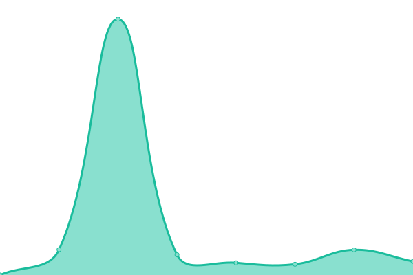
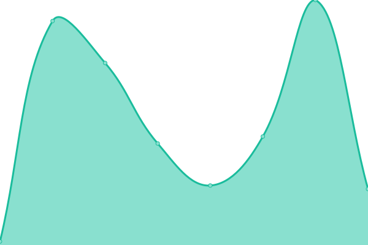
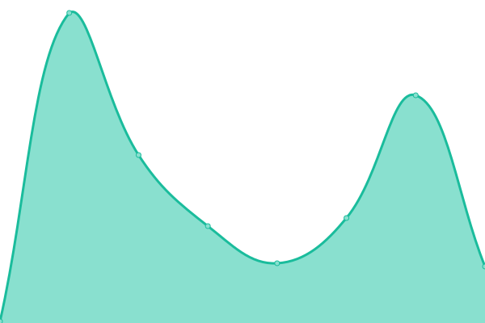

# [📈 Live Status](https://mikemahoney218.github.io/uptime_proof): <!--live status--> **🟩 All systems operational**

This repository contains the open-source uptime monitor and status page for [Michael Mahoney](https://mm218.dev/), powered by [Upptime](https://github.com/upptime/upptime).

With [Upptime](https://upptime.js.org), you can get your own unlimited and free uptime monitor and status page, powered entirely by a GitHub repository. We use [Issues](https://github.com/mikemahoney218/uptime_proof/issues) as incident reports, [Actions](https://github.com/mikemahoney218/uptime_proof/actions) as uptime monitors, and [Pages](https://mikemahoney218.github.io/uptime_proof) for the status page.

<!--start: status pages-->
<!-- This summary is generated by Upptime (https://github.com/upptime/upptime) -->
<!-- Do not edit this manually, your changes will be overwritten -->
<!-- prettier-ignore -->
| URL | Status | History | Response Time | Uptime |
| --- | ------ | ------- | ------------- | ------ |
|  [iv](https://waterservices.usgs.gov/nwis/iv/?format=json&sites=01103025) | 🟩 Up | [iv.yml](https://github.com/mikemahoney218/uptime_proof/commits/HEAD/history/iv.yml) | 

 281ms
     
 | 

<a href="https://mikemahoney218.github.io/uptime_proof/history/iv">100.00%</a>
    

|  [dv](https://waterservices.usgs.gov/nwis/dv/?format=json&sites=01103025) | 🟩 Up | [dv.yml](https://github.com/mikemahoney218/uptime_proof/commits/HEAD/history/dv.yml) | 

 63ms
     
 | 

<a href="https://mikemahoney218.github.io/uptime_proof/history/dv">100.00%</a>
    

|  [site](https://waterservices.usgs.gov/nwis/site/?format=rdb&sites=01103025) | 🟩 Up | [site.yml](https://github.com/mikemahoney218/uptime_proof/commits/HEAD/history/site.yml) | 

 39ms
     
 | 

<a href="https://mikemahoney218.github.io/uptime_proof/history/site">100.00%</a>
    

|  [stats](https://waterservices.usgs.gov/nwis/stat/?format=rdb&sites=01103025&statReportType=daily&statTypeCd=all) | 🟩 Up | [stats.yml](https://github.com/mikemahoney218/uptime_proof/commits/HEAD/history/stats.yml) | 

 79ms
     
 | 

<a href="https://mikemahoney218.github.io/uptime_proof/history/stats">100.00%</a>
    

|  [gwlevels](https://waterservices.usgs.gov/nwis/gwlevels/?format=json&sites=422819071065701) | 🟩 Up | [gwlevels.yml](https://github.com/mikemahoney218/uptime_proof/commits/HEAD/history/gwlevels.yml) | 

 16856ms
     
 | 

<a href="https://mikemahoney218.github.io/uptime_proof/history/gwlevels">100.00%</a>
    

<!--end: status pages-->

[**Visit our status website →**](https://mikemahoney218.github.io/uptime_proof)

## 📄 License

- Powered by: [Upptime](https://github.com/upptime/upptime)
- Code: [MIT](./LICENSE) © [Anand Chowdhary](https://anandchowdhary.com), supported by [Pabio](https://pabio.com)
- Data in the `./history` directory: [Open Database License](https://opendatacommons.org/licenses/odbl/1-0/)
